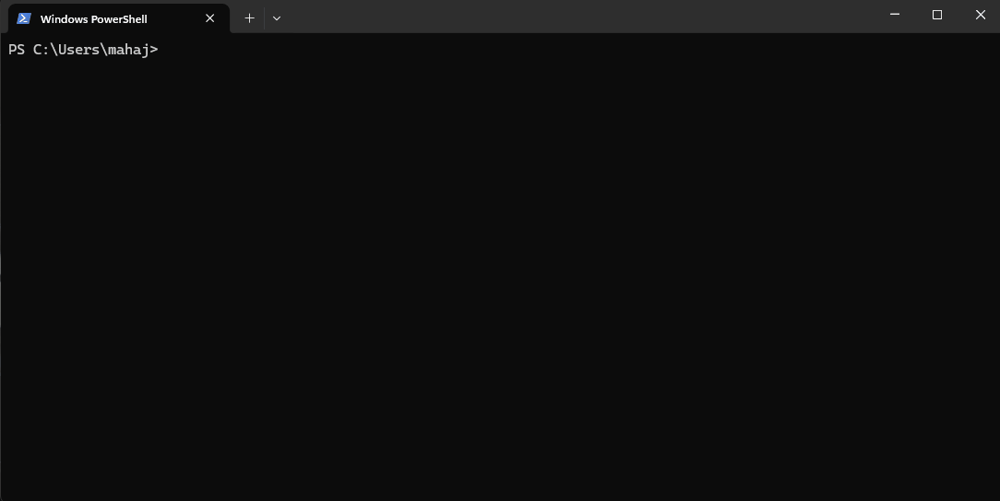

# buzz

> Keep your Windows machine awake from the command line. Like macOS `caffeinate`, but for Windows.

[](https://github.com/mahajandhruv26/buzz/actions/workflows/ci.yml)
[](LICENSE)
[](https://www.rust-lang.org/)

<p align="center">
  
</p>

Single binary. ~200 KB. No installation. No dependencies. No admin rights.

---

## Quick Start

```powershell
scoop bucket add buzz https://github.com/mahajandhruv26/buzz
scoop install buzz
buzz -s -t 10s
```

Or download `buzz.exe` from [releases](https://github.com/mahajandhruv26/buzz/releases/latest) and run it. No installer, no setup.

**Verify it's working** — while `buzz` is running, open another terminal:

```powershell
powercfg /requests
```

You should see an active `SYSTEM` or `DISPLAY` request from `buzz.exe`.

---

## Why buzz?

| Without buzz | With buzz |
|---|---|
| Start a 2-hour build, come back to find Windows slept at 15 minutes | `buzz -i cargo build` — sleeps only after build completes |
| Present to a client, screen locks every 5 minutes | `buzz -s -u -t 2h` — display on, lock defeated, auto-stops |
| Change power settings manually, forget to change them back | `buzz -t 5m` — always restores automatically |
| Download a 50 GB file, transfer dies mid-way | `buzz -i curl -O url` — system stays awake until download finishes |
| Write a PowerShell workaround that doesn't handle crashes | `buzz` cleans up on Ctrl+C, crash, kill, or panic |

---

## Features

| Feature | Flag | Description |
|---|---|---|
| System sleep prevention | `-i` | Prevents Windows from entering sleep or hibernate |
| Display sleep prevention | `-s` / `-d` | Keeps the screen on |
| Timed awakening | `-t <dur>` | Auto-exit after duration (`5m`, `2h`, `1h30m`, or seconds) |
| Run a command | `[COMMAND]` | Stay awake while a subprocess runs, exit when it finishes |
| Watch a process | `-w <pid>` | Stay awake until an existing process exits |
| User activity simulation | `-u` | Simulates keystrokes to defeat screen lock policies |
| Graceful cleanup | — | Always restores normal sleep on exit, Ctrl+C, crash, or kill |
| Smart defaults | — | No flags = system awake indefinitely |
| Composable flags | — | All flags combine freely in any order |
| Stdout logging | — | Clear status messages at every state transition |
| Zero dependencies | — | Single .exe, ~200 KB, runs on any Windows 10+ machine |

---

## Installation

### Scoop (recommended)

```powershell
scoop bucket add buzz https://github.com/mahajandhruv26/buzz
scoop install buzz
```

Done. `buzz` is in your PATH. Works immediately.

### Download binary

1. Download `buzz.exe` from [latest release](https://github.com/mahajandhruv26/buzz/releases/latest)
2. Put it somewhere permanent, then either:
   - Copy to `C:\Windows\System32\` (needs admin, works immediately)
   - Or add its folder to PATH ([how?](docs/TROUBLESHOOTING.md#command-not-found))

### Cargo install (if you have Rust)

```powershell
cargo install --git https://github.com/mahajandhruv26/buzz
```

One command. No PATH setup needed — goes straight into `~/.cargo/bin/`.

### Build from source

```powershell
git clone https://github.com/mahajandhruv26/buzz.git
cd buzz
cargo build --release
```

Binary at `target\release\buzz.exe`. Copy to `C:\Windows\System32\` or add its folder to PATH.

### Verify

```powershell
buzz -h
```

---

## Usage Examples

```powershell
buzz                          # keep system awake until Ctrl+C
buzz -s                       # keep screen on
buzz -s -t 2h                 # screen on for 2 hours
buzz -s -u -t 2h              # screen on + defeat lock screen
buzz -i cargo build --release  # system awake while building
buzz -w 1234                  # awake until PID 1234 exits
buzz -s -- -my-weird-command   # use -- for commands starting with -
```

---

## Comparison with macOS caffeinate

| Feature | macOS `caffeinate` | Windows `buzz` |
|---|---|---|
| Prevent system sleep | `-s` | `-i` |
| Prevent display sleep | `-d` | `-s` / `-d` |
| Prevent disk sleep | `-m` | N/A |
| Timed mode | `-t <seconds>` | `-t <duration>` (`5m`, `2h`, `1h30m`, or seconds) |
| Run a command | `caffeinate cmd` | `buzz cmd` |
| Simulate user activity | N/A | `-u` |
| Attach to PID | `-w <pid>` | `-w <pid>` |
| Exit code propagation | Yes | Yes |
| Binary size | Built into macOS | ~200 KB |

> **Flag naming:** `-s` = **s**creen, `-i` = **i**dle. Use `-d` if you prefer caffeinate-style.

---

## System Requirements

| Requirement | Detail |
|---|---|
| **OS** | Windows 10+ (Home, Pro, Enterprise, Server) |
| **Architecture** | x86_64 (64-bit) |
| **Build** | Rust 1.70+ with `stable-x86_64-pc-windows-msvc` |
| **Privileges** | Standard user (no admin required) |
| **Size** | ~200 KB |

---

## Documentation

| Document | Audience | Description |
|---|---|---|
| [User Guide](docs/USER_GUIDE.md) | Users | All flags, scenarios, and examples |
| [Troubleshooting](docs/TROUBLESHOOTING.md) | Users | Common problems and fixes |
| [Architecture](ARCHITECTURE.md) | Engineers | System design, module relationships, API internals |
| [Design Decisions](DESIGN_DECISIONS.md) | Engineers | Why we chose X over Y (ADR format) |
| [Contributing](docs/CONTRIBUTING.md) | Contributors | Build, test, lint, PR process, code standards |
| [Changelog](CHANGELOG.md) | Everyone | Release notes |

---

## Testing

67 tests across two levels:

```powershell
cargo test               # all tests
cargo test --bin buzz    # unit tests only (45)
cargo test --test integration  # integration tests only (22)
```

---

## Contributing

1. Fork the repository
2. Create a feature branch: `git checkout -b feature/my-feature`
3. Test: `cargo fmt && cargo clippy && cargo test`
4. Submit a pull request

See [Contributing](docs/CONTRIBUTING.md) for build instructions and code standards.

---

## License

MIT. See [LICENSE](LICENSE).
